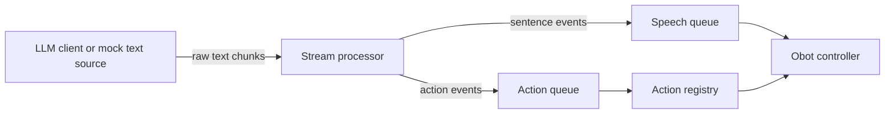

# UbiqSystems-OhBot-Behaviors-Engine

folder is a Python skeleton for the robot chatbot flow.

## Design

System is split into four layers:

1. LLM source: produces raw streamed text.
2. Stream processor: removes control tags like `[nod]`, buffers text, and emits sentence/action events.
3. Action registry: maps action names to dedicated robot motion functions.
4. Obot controller: owns the speech and hardware-facing commands.

## Data Flow



## Demo

Run the the following for a demo without the Obot:

```bash
python -m demo --text "Hello there [nod] I will speak one sentence at a time."
```
