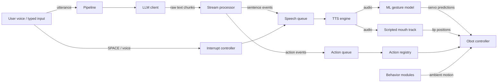

# UbiqSystems-OhBot-Behaviors-Engine

The behaviour engine for our OhBot robot ("Ms. Mimic"). It streams LLM responses, parses inline action/emotion markers, and drives speech and servo motion in real time with a [desktop GUI](#desktop-gui) for setup, configuration and live conversations, and an ML gesture model that predicts natural head/eye motion from audio.

## Design

The system splits into seven layers:

1. **LLM source**: produces raw streamed text (Gemini, Ollama, or a scripted replay).
2. **Stream processor**: removes control tags like `[nod]`, buffers text, and emits sentence/action/emotion events.
3. **Action registry**: maps action names to dedicated robot motion functions.
4. **Speech engine** (`obot.speech`): synthesizes each sentence, plays it back interruptibly, animates lips from real audio, and fires markers at the exact word they were written on.
5. **ML gesture model** (`obot.ml`): a BEAT2-trained Conv1d + GRU network that predicts servo positions from live audio features, driving natural head tilt, eye gaze and lid movement in real time.
6. **Behavior modules** (`obot.robot.behaviors`): ambient life blinking, nodding along while you talk, subtle sway while speaking, idle eye wandering.
7. **Obot controller**: owns the motor mixer and hardware-facing commands. Four implementations: `HardwareObotController` (real servos), `SimulatedObotController` (digital OhBot window), `VirtualObotController` (headless, joints streamed to GUI), and `ConsoleObotController` (prints what the robot would do).

## Data Flow



## Project layout

```
src/obot/            # the package (run with: python -m obot)
  __main__.py        # CLI entry point + session loop
  config.py          # config.json load/save
  core/              # pipeline: orchestrator, processor, models, interrupt
  llm/               # LLM sources: client, gemini, ollama, picker
  robot/             # controllers (hardware/sim/console), actions, behaviors, joints
  speech/            # custom say(): TTS engines, player, timeline, mouth animation
  ml/                # AI gesture model: inference, driver, replay dataset
  sim/               # digital OhBot: tkinter face window (python -m obot.sim)
  audio/             # microphone input and keyboard controls
  server/            # WebSocket control server (python -m obot --serve)
  net/               # SSH tunnel for remote Ollama
mlBehaviour/         # ML training pipeline (BEAT2 → OhBot servo data)
gui/                 # Avalonia desktop GUI (see gui/README.md)
tests/               # server smoke test
requirements/        # per-platform dependency lists (windows, linux, pi, ml)
docs/                # detailed documentation
```

## Quick start

> **Just want to run it?** Download the latest
> [release](https://github.com/BloodWolfPlayer/UbiqSystems-OhBot-Behaviors-Engine/releases),
> extract it and start `OhBotControl` — the app sets Python up for you and only needs the
> [.NET 10 runtime](https://dotnet.microsoft.com/download/dotnet/10.0) on the machine.
> The steps below are for working from a checkout.

### 1. Install

```bash
pip install -e .
```

Then install dependencies for your platform:

| Platform | Command |
|---|---|
| Windows | `pip install -r requirements/windows.txt` |
| Linux | `pip install -r requirements/linux.txt` |
| Raspberry Pi | `pip install -r requirements/pi.txt` |
| + ML gesture model (optional) | `pip install -r requirements/ml.txt` |

The ML extras are a large, optional download (torch), so they are left out of the base
install. You can also install them from the GUI: the **ML Control** page lists every
dependency it is missing and installs `requirements/ml.txt` into the engine's own
environment for you.

> **Linux note:** `sounddevice` and `pyttsx3` need system libraries:
> ```bash
> sudo apt install libportaudio2 espeak-ng
> ```

> The Linux installation currently also has issues running the Ohbot hardware. GUI and simulation work fine, but the hardware controller fails.

> **Python version:** Use **Python 3.12**. On distros that ship a newer Python (Ubuntu 25+), the GUI's automatic setup downloads a private 3.12.

**On Windows and Linux you can skip all of this.** The desktop GUI sets Python up for you, no terminal required.

### 2. Configure

```bash
cp config.example.json config.json
```

Fill in the keys you need (see [docs/config.md](docs/config.md) for a full field reference).

### 3. Run

**Desktop GUI (recommended):**

```bash
cd gui
dotnet run --project ObotControl.App/ObotControl.App.csproj
```

Then click **Launch engine** (or **Attach**), the GUI drives everything via the control server.

**Engine server (for the GUI or headless use):**

```bash
python -m obot --serve              # ws://127.0.0.1:8765
```

Using specific flag will chagne how the engine behaves. For more information on various CLI entry points, see [docs/cli.md](docs/cli.md).

**Standalone (no GUI):**

```bash
python -m obot                      # interactive: pick backend, mic, then talk
python -m obot --sim                # use the digital OhBot simulator
python -m obot --console            # no window, no audio, prints actions
```

**Quick verification (no API key needed):**

```bash
python -m obot --text "Hello [Nod] (Sad) I am tired. !Delay500 But not for long [Blink]."
```

---

## Desktop GUI

A single **Avalonia** app that runs natively on Windows, Linux and the Pi. It handles setup, config editing, and live conversations, sitting as a thin client over the engine's WebSocket server. Full details in [gui/README.md](gui/README.md).

---

## ML Gesture Model

The `obot.ml` module can drive natural head/eye/lid motion from a neural network trained on the [BEAT2 dataset](https://beatresearch.github.io/). During live conversation, it takes the TTS audio and predicts servo positions at 20 Hz, producing lifelike movement that's synced to speech rhythm.

Run it standalone against a wav file:

```bash
python -m obot.ml mlBehaviour/runs/my_experiment/best_model.pt audio.wav --sim
```

Ensure the engine server is running (`python -m obot --serve`) and the GUI is connected to see the predicted motion in the simulator.

Training pipeline and dataset conversion live in [mlBehaviour/](mlBehaviour/README.md).

---

## Building a release

[`scripts/package-release.ps1`](scripts/package-release.ps1) builds the downloadable
package: the GUI published as **one framework-dependent executable** (all of Avalonia's
managed and native dependencies bundled inside it, .NET 10 expected on the target machine)
sitting at the top of the Python engine tree, which is exactly where the GUI looks for it.

```powershell
powershell -File scripts/package-release.ps1 -Runtime win-x64,linux-x64
```

Archives and a `SHA256SUMS` file land in `dist/` — about 12 MB each, 79 files extracted.
The Python payload is taken from `git ls-files`, so anything untracked (your `config.json`
with its API key, the gigabytes of downloaded voice models in `ohbotData/`, the venv) can
never end up in a release. `config.json` is seeded from `config.example.json` so a fresh
download starts with the gesture model enabled and the bundled checkpoint registered.

---

## Further documentation

| Topic | Location |
|---|---|
| CLI flags and all entry points | [docs/cli.md](docs/cli.md) |
| Speech engine and TTS voices | [docs/speech.md](docs/speech.md) |
| WebSocket server protocol | [docs/server.md](docs/server.md) |
| Configuration reference | [docs/config.md](docs/config.md) |
| ML training pipeline | [mlBehaviour/README.md](mlBehaviour/README.md) |
| Desktop GUI | [gui/README.md](gui/README.md) |
