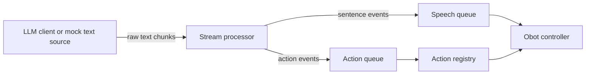

# UbiqSystems-OhBot-Behaviors-Engine

folder is a Python skeleton for the robot chatbot flow.

## Design

System is split into four layers:

1. LLM source: produces raw streamed text.
2. Stream processor: removes control tags like `[nod]`, buffers text, and emits sentence/action events.
3. Action registry: maps action names to dedicated robot motion functions.
4. Obot controller: owns the speech and hardware-facing commands.

## Data Flow



## Demo

Run the the following for a demo without the Obot:

```bash
python -m demo --text "Hello there [nod] I will speak one sentence at a time."
```

## Large Language Model Connection

The pipeline can be driven by a real LLM instead of the scripted source. Two backends are supported, picked interactively when you start `python -m demo` without `--text`.

### Backends

1. **Online (Gemini)**
   Connects to Google's Generative Language API using your own key. Every model the key has access to is listed on startup, so you can pick whichever Gemini model you want for that session. (Sebastian has the key, just ask em if ya need it.) 

2. **Remote Ollama (over SSH)**
   Talks to an Ollama server running on another machine. The code opens an SSH port forward using your private key, then speaks plain HTTP through the tunnel as if Ollama were local. The model list comes from the remote `/api/tags`, so only models actually installed on that server show up. (todo: Test out on different models)

3. **Scripted demo**
   The original `--text "..."` flow is kept for development and regression checks. It needs no extra dependencies and no config. It is mainly there to sanity check if stuff broke.

### First time setup (llm) 

1. Install the runtime dependencies if not done already.
   ```bash
   pip install -r requirements.txt
   ```
2. Copy the config template and fill it in.
   ```bash
   cp config.example.json config.json
   ```
   `config.json` is gitignored. If you lose the keys, ask Sebastian.
```
```
3. (Optional) Edit `system_prompt.txt` to change the persona if need be. The default is Stephan the comedian  that uses `[Action]` keys, `(Emotion)` markers and `!DelayX` pauses.

### `config.json` fields

| Field | Meaning |
|---|---|
| `gemini_api_key` | API key from Google AI Studio. Only needed for the online backend. |
| `ollama_ssh.host` | Hostname or IP of the SSH server that hosts Ollama. |
| `ollama_ssh.port` | SSH port, default 22. |
| `ollama_ssh.user` | SSH username. |
| `ollama_ssh.key_path` | Path to your private key file (OpenSSH format). |
| `ollama_ssh.remote_ollama_host` | Where Ollama listens on the remote side. Usually `localhost`. |
| `ollama_ssh.remote_ollama_port` | The remote Ollama port, default `11434`. |
| `recent_gemini_models` | Maintained automatically. Holds the last three Gemini models locally picked. |
| `recent_ollama_models` | Same idea, but for the llama. |

### Running

```bash
python -m demo
```

You will see:

```
Pick a backend:
  [1] Online (Gemini)
  [2] Remote Ollama (over SSH)
  [3] Scripted demo
```

After picking a backend, the list of available models is fetched live. Recently used models appear at the top of the list marked `(recent)`. Pick a model, then chat with the bot. Empty line or `:quit` exits.

### System prompt syntax

The bot's response is parsed for three kinds of control markers:

- `[Action]` keys (square brackets): trigger robot motions. Built in keys are `Nod`, `Blink`, `Wink`, `LookLeft`, `LookRight`, `ShakeHead`, `Wave`. Names are case insensitive.
- `(Emotion)` markers (round brackets): set the displayed emotion. Examples: `(Happy)`, `(Sad)`, `(Confused)`, `(Angry)`, `(Exhausted)`, `(Whispering)`, `(Shouting)`.
- `!DelayX` markers: insert a pause of `X` milliseconds after the current sentence finishes speaking, before the next one starts.

Anything else in the response is treated as spoken text and split into sentences on `.`, `!` and `?`.

### Quick verification without Gemini or Ollama

To confirm the parser and dispatcher work, the scripted backend still runs offline:

```bash
python -m demo --text "Hello [Nod] (Sad) I am tired. !Delay500 But not for long [Blink]."
```

Expected output:

```
[speech] Hello I am tired.
[action] nod
[emotion] Sad
[speech] But not for long .
[action] blink
```
