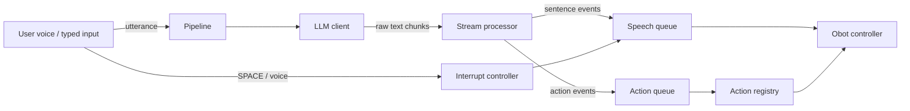

# UbiqSystems-OhBot-Behaviors-Engine

A Python pipeline for the Obot chatbot robot, streams LLM responses, parses action/emotion markers, and drives speech and servo motion in real time.

## Design

System is split into four layers:

1. **LLM source**: produces raw streamed text (Gemini, Ollama, or a scripted replay).
2. **Stream processor**: removes control tags like `[nod]`, buffers text, and emits sentence/action/emotion events.
3. **Action registry**: maps action names to dedicated robot motion functions.
4. **Obot controller**: owns speech and hardware-facing commands. Two implementations: `HardwareObotController` (real servos via the `ohbot` library) and `ConsoleObotController` (prints what the robot would do, for dev/testing).

## Data Flow



## Project layout

```
src/obot/            # the package (run with: python -m obot)
  __main__.py        # CLI entry point + session loop
  config.py          # config.json load/save
  core/              # pipeline: orchestrator, processor, models, interrupt
  llm/               # LLM sources: client, gemini, ollama, picker
  robot/             # controller (hardware + console) and action registry
  audio/             # microphone input and keyboard controls
  net/               # SSH tunnel for remote Ollama
requirements/        # per-platform dependency lists (windows, linux, pi)
docs/                # presentation and design material
ohbotData/           # robot data (motor defs, sounds) — read by the ohbot library
system_prompt.txt    # bot persona (edit to change behaviour)
example_script.txt   # capability-demo script
config.example.json  # copy to config.json and fill in
```

## Quick start

### 1. Install dependencies

First install the package itself (editable, so `python -m obot` works from the repo root):

```bash
pip install -e .
```

Then install the dependencies for your platform:

| Platform | Command |
|---|---|
| Windows (dev/testing) | `pip install -r requirements/windows.txt` |
| Linux (dev/testing) | `pip install -r requirements/linux.txt` |
| Raspberry Pi (deployment) | `pip install -r requirements/pi.txt` |

> **Linux note:** `sounddevice` and `pyttsx3` need system packages first:
> ```bash
> sudo apt install portaudio19-dev espeak
> ```

> **Python version:** Use **Python 3.12**. Pre-built wheels for `sounddevice`, `vosk`, and other heavy deps are available for 3.12 on both Windows and Linux. Python 3.13+ is not yet fully supported by the audio stack and gives mixed results.

### 2. Configure

```bash
cp config.example.json config.json
```

`config.json` is gitignored. Fill in the keys you need (see the field reference below). If you lose the API keys, ask Sebastian.

### 3. Run

Run from the repo root (so the `ohbotData/` folder and `config.json` are found):

```bash
python -m obot
```

---

## Backends

Pick one at startup:

1. **Online (Gemini)**: Connects to Google's Generative Language API using a API Key. Every model the key TECHNICALLY has access to is listed live, so you can pick whichever Gemini model you want per session. **MAKE SURE YOU VERIFY THE MODEL FIRST ON THE AISTUDIO SITE!** (Sebastian has the key, just ask.)

2. **Remote Ollama (over SSH)**: Talks to an Ollama server on another machine. The code opens an SSH port-forward using your private key, then speaks plain HTTP through the tunnel as if Ollama were local. The model list comes from the remote `/api/tags`.

3. **Scripted demo**: Replays a fixed string, no API or config needed. Good for sanity-checking the parser.

4. **Example script**: Full capability demo from `example_script.txt`.

---

## Running without the robot

The whole program runs on a plain dev machine, no `ohbot` library, no servos needed. When `ohbot` cannot be imported, the demo automatically falls back to `ConsoleObotController`, which prints what the robot *would* do (`[speech]`, `[action]`, `[emotion]`) and simulates timing. You can test LLM streaming, interruption, and the microphone path end-to-end without any hardware.

Force it even when hardware is present by using:

```bash
python -m obot --console
```

---

## Microphone input

For the Gemini and Ollama backends you talk to the bot with the host machine's microphone. Capture uses [sounddevice](https://python-sounddevice.readthedocs.io/), which is a cross-platform PortAudio wrapper that installs without a C compiler on Windows.

### Startup picks (after model selection)

**1. Microphone**

The list shows only real physical devices from a single host API (WASAPI on Windows), so each mic appears exactly once with its full name. After you pick:

- A **live level meter** records ~3 seconds so you can see if the mic is responding.
- It **plays the recording back** so you can hear whether it sounds correct.
- Answer `Y` to confirm or anything else to re-pick.

Your choice is saved to `config.json` and offered as the default next time.

**2. Speech-to-text engine**

| Engine | Mode | Notes |
|---|---|---|
| **Vosk** | Offline | Runs on the Pi with no internet. Needs a model file (see below). |
| **Google** | Online | Higher accuracy, no model file, requires internet. |

### Vosk offline model setup

Two options.
Option 1: use run " sprc download vosk " to download and set up a model automatically (recommended).
Option 2: manually set up a model yourself, which is more work but lets you pick from the full range of Vosk models.
1. Download a model from [alphacephei.com/vosk/models](https://alphacephei.com/vosk/models).
   - `vosk-model-small-en-us-0.15` (~40 MB) — fast, good for the Pi.
   - `vosk-model-en-us-0.22` (~1.8 GB) — more accurate, heavier.
2. Unzip it. You get a folder like `vosk-model-small-en-us-0.15/` whose contents are `am/`, `conf/`, `graph/`, `ivector/`, `README`.
3. Point `audio.vosk_model_path` in `config.json` at **that folder** (the one directly containing `am`, `conf`, `graph` — not a file inside it, not the zip).

```json
"audio": {
  "vosk_model_path": "C:/path/to/vosk-model-small-en-us-0.15"
}
```

Forward slashes work on Windows. Relative paths are resolved from where you run `python -m obot`.

### Session controls

| Key | Action |
|---|---|
| `SPACE` | Interrupt the bot while it is speaking |
| `m` | Mute / unmute the microphone |
| `p` | Push-to-talk — capture a single utterance then wait |
| `o` | Open mic (back to continuous auto-VAD) |
| `c` | Switch to **console mode** — type messages instead of speaking |
| `q` / `Esc` | Quit |

### Console mode

Press `c` during a session to switch to typed input (mic mutes, key shortcuts pause, a `[console] >` prompt appears). Type a message and Enter to send. Press Enter on an **empty line** or type `:voice` to go back to the microphone. `:quit` exits.

Useful for quick testing when the mic isn't working or you want to script a specific prompt.

### Interrupting the bot

While the bot is speaking, cut it off two ways:

- **Start talking**: voice barge-in detects sustained loudness and fires immediately.
- **Press `SPACE`**: always reliable, no echo risk.

Speech stops at the current **sentence boundary**, all remaining sentences are dropped, and the bot is told on its next turn:
- what it actually said aloud,
- what it had been about to say.

It will acknowledge the interruption naturally rather than repeating itself.

> **Echo caveat.** With a speaker and mic close together, the bot may hear its own voice and trip a false barge-in. Voice onset detection only arms while the bot is speaking, and uses a raised threshold, but on noisy setups prefer `SPACE` or mute (`m`). Full acoustic echo cancellation is out of scope due to hardware limitations.

---

## `config.json` fields

| Field | Meaning |
|---|---|
| `gemini_api_key` | API key from Google AI Studio. Only needed for the Gemini backend. |
| `ollama_ssh.host` | Hostname or IP of the SSH server running Ollama. |
| `ollama_ssh.port` | SSH port, default `22`. |
| `ollama_ssh.user` | SSH username. |
| `ollama_ssh.key_path` | Path to the private key file (OpenSSH format). |
| `ollama_ssh.remote_ollama_host` | Where Ollama listens on the remote side. Usually `localhost`. |
| `ollama_ssh.remote_ollama_port` | Remote Ollama port, default `11434`. |
| `audio.input_device_index` | Saved microphone device index. Maintained automatically by the mic picker. |
| `audio.stt_engine` | Last STT engine picked: `vosk` or `google`. Maintained automatically. |
| `audio.vosk_model_path` | Path to an unzipped Vosk model directory. Required only for offline STT. Only needed if using custom models.|
| `recent_gemini_models` | MRU list of Gemini models (last 3). Maintained automatically. |
| `recent_ollama_models` | Same idea for Ollama. Maintained automatically. |

---

## System prompt syntax

Edit `system_prompt.txt` to change the bot's persona. The parser recognises three kinds of inline markers:

- **`[Action]`** (square brackets) — trigger robot motions. Built-in: `Nod`, `Blink`, `Wink`, `LookLeft`, `LookRight`, `ShakeHead`. Case-insensitive.
- **`(Emotion)`** (round brackets) — set the displayed emotion. Built-in: `Happy`, `Sad`, `Confused`, `Angry`, `Exhausted`, `Whispering`, `Shouting`. Stays set until overwritten.
- **`!DelayX`** — insert a pause of `X` milliseconds after the current sentence ends, before the next begins.

Everything else is treated as spoken text, split into sentences on `.`, `!`, and `?`.

---

## Quick verification (no API or example file needed)

```bash
python -m obot --text "Hello [Nod] (Sad) I am tired. !Delay500 But not for long [Blink]."
```

Expected output:

```
[speech] Hello I am tired.
[action] nod
[emotion] Sad
[speech] But not for long .
[action] blink
```
