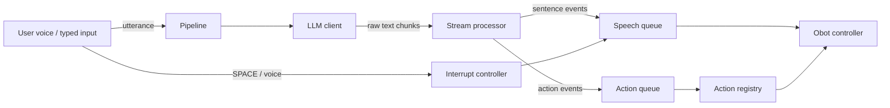

# UbiqSystems-OhBot-Behaviors-Engine

The behaviour engine for our OhBot robot ("Ms. Mimic"). It streams LLM responses, parses inline action/emotion markers, and drives speech and servo motion in real time — with a [desktop GUI](#desktop-gui) over the top for setup, configuration and live conversations.

## Design

The system splits into six layers:

1. **LLM source**: produces raw streamed text (Gemini, Ollama, or a scripted replay).
2. **Stream processor**: removes control tags like `[nod]`, buffers text, and emits sentence/action/emotion events.
3. **Action registry**: maps action names to dedicated robot motion functions.
4. **Speech engine** (`obot.speech`): our replacement for `ohbot.say()`. Synthesizes each sentence (Gemini TTS or a local offline voice), plays it back interruptibly, animates the lips from the real audio, and fires `[Action]`/`(Emotion)` markers at the exact word they were written on.
5. **Behavior modules** (`obot.robot.behaviors`): ambient life, blinking, nodding along while you talk to it, subtle sway while speaking, idle eye wandering.
6. **Obot controller**: owns the motor mixer and hardware-facing commands. Four implementations: `HardwareObotController` (real servos via the `ohbot` library), `SimulatedObotController` (the digital OhBot window), `VirtualObotController` (headless — full mixer and TTS, joints streamed to the GUI's face preview), and `ConsoleObotController` (prints what the robot would do).

## Data Flow



## Project layout

```
src/obot/            # the package (run with: python -m obot)
  __main__.py        # CLI entry point + session loop
  config.py          # config.json load/save
  core/               # pipeline: orchestrator, processor, models, interrupt
  llm/                # LLM sources: client, gemini, ollama, picker
  robot/              # controllers (hardware/sim/console), actions, behaviors, joints
  speech/             # custom say(): TTS engines, player, timeline, mouth animation
  sim/                # digital OhBot: tkinter face window (python -m obot.sim)
  audio/              # microphone input and keyboard controls
  net/                # SSH tunnel for remote Ollama
gui/                 # Avalonia desktop GUI (see gui/README.md)
tests/               # server smoke test (tests/test_server_smoke.py)
requirements/        # per-platform dependency lists (windows, linux, pi)
docs/                # presentation and design material
ohbotData/           # robot data (motor defs, sounds), used by the ohbot library
system_prompt.txt    # bot persona (edit to change behaviour)
example_script.txt   # capability-demo script
config.example.json  # copy to config.json and fill in
```

## Quick start

### 1. Install dependencies

First install the package itself (editable, so `python -m obot` works from the repo root):

```bash
pip install -e .
```

Then install the dependencies for your platform:

| Platform | Command |
|---|---|
| Windows (dev/testing) | `pip install -r requirements/windows.txt` |
| Linux (dev/testing) | `pip install -r requirements/linux.txt` |
| Raspberry Pi (deployment) | `pip install -r requirements/pi.txt` |

> **Linux note:** `sounddevice` and `pyttsx3` need system packages first:
> ```bash
> sudo apt install portaudio19-dev espeak
> ```

> **Python version:** Use **Python 3.12**. Pre-built wheels for `sounddevice`, `vosk`, and other heavy deps are available for 3.12 on both Windows and Linux. Python 3.13+ isn't fully supported by the audio stack yet and gives mixed results.

**On Windows you can skip all of this.** The [desktop GUI](#desktop-gui) sets Python up for you, no terminal required. See below.

### 2. Configure

```bash
cp config.example.json config.json
```

`config.json` is gitignored. Fill in the keys you need (see the field reference below). If you lose the API keys, ask Sebastian.

### 3. Run

Run from the repo root (so the `ohbotData/` folder and `config.json` are found):

```bash
python -m obot
```

---

## Backends

Pick one at startup:

1. **Online (Gemini)**: Connects to Google's Generative Language API using an API key. Every model the key TECHNICALLY has access to is listed live, so you can pick whichever Gemini model you want per session. **MAKE SURE YOU VERIFY THE MODEL FIRST ON THE AISTUDIO SITE!** (Sebastian has the key, just ask.)

2. **Remote Ollama (over SSH)**: Talks to an Ollama server on another machine. The code opens an SSH port-forward using your private key, then speaks plain HTTP through the tunnel as if Ollama were local. The model list comes from the remote `/api/tags`.

3. **Scripted demo**: Replays a fixed string, no API or config needed. Good for sanity-checking the parser.

4. **Example script**: Full capability demo from `example_script.txt`.

---

## Speech: the custom say()

`ohbot.say()` is gone. Speech now runs through `obot.speech.SpeechEngine`:

- **Voices:** Pick one with `speech.tts.engine`, or leave it on `"auto"` to chain through the best available:
  - **Edge** (`edge`): Microsoft's neural voices via `edge-tts`. Online, free, no API key, and the most natural-sounding of the free options (Azure quality: `en-GB-SoniaNeural`, `en-US-AriaNeural`, ...). Unofficial endpoint, needs internet.
  - **Kokoro** (`kokoro`): a small open neural model running fully offline via ONNX. The best local voice, noticeably better than Piper, and faster than real time on CPU. Model (~330 MB) and voices auto-download to `ohbotData/kokoro/` the first time you use it; bundles espeak-ng, so there's nothing to install system-side. British voices `bf_emma`/`bf_alice`, pace via `speed`.
  - **gTTS** (`gtts`): Google Translate TTS. Online, free, no key, decent quality. The "voice" here is really the accent, set via `tld` (`co.uk`, `com`, `com.au`, ...).
  - **Gemini** (`gemini`): very natural, but needs `gemini_api_key`, and the free tier only gives you about 3 requests a minute.
  - **Piper** (`piper`): offline neural TTS, a solid fallback. Voice `en_GB-cori-high`, model auto-downloads to `ohbotData/piper/`. Pace via `length_scale`.
  - **Basic local** (`local`): SAPI/espeak. Robotic, but dependency-free, and always there as a last resort.

  The online voices (edge/gtts) come back as MP3 and get decoded to PCM through `miniaudio`. `"auto"` chains edge → kokoro → piper → local, so you get near-Azure quality when you're online and a solid offline voice when you're not; it basically never fully fails. A voice that's currently failing gets benched for `failure_cooldown_s` so it stops adding a timeout to every sentence.
- **Fast output.** The next sentence starts synthesizing while the current one is still playing, so the round-trip to Gemini (or whichever engine) hides behind playback instead of causing a stutter.
- **Interruption at word boundaries.** Barge-in and SPACE don't cut the audio off mid-phoneme. Playback finishes the word it's currently voicing (plus a small fade) and then goes quiet. Any remaining sentences get dropped, and the LLM is told on its next turn what was actually said and what wasn't.
- **Lip sync.** The mouth moves based on the real audio: an RMS envelope gets gated, curved and smoothed into lip positions. Every parameter (`gate`, `gamma`, `attack`, `release`, gains, fps, sync offset) lives in `config.json` under `speech.mouth`, and can be tuned live with sliders in the simulator.
- **Timed actions mid-sentence.** `[Nod]` written between two words fires exactly when that word gets spoken (character position mapped to a word timeline, mapped to the playback clock), not at some guessed fraction of the sentence.

## Behavior modules

`obot.robot.behaviors.BehaviorManager` runs ambient gestures depending on what the robot is doing (`idle` / `listening` / `speaking`):

| Module | When | What |
|---|---|---|
| `auto_blink` | always | periodic blinks, occasional double blink |
| `listening_nod` | while the user talks | small attentive nods ("mm-hm") |
| `speaking_sway` | while the bot talks | subtle head/eye drift so it never freezes |
| `idle_wander` | idle | eyes (sometimes head) wander and linger |

Each module has `enabled`, `min_interval_s`, `max_interval_s`, `intensity` in `config.json → behaviors`. Adding a new module is one entry in `default_modules()`.

---

## Running without the robot

Two hardware-free options:

**1. The digital OhBot (recommended):**

```bash
python -m obot --sim            # full pipeline against the simulator window
python -m obot.sim              # standalone speech/motion test bench
python -m obot.sim --text "Hello [Nod] world! (Happy) Great to see you."
```

The window renders head pose, eyes, lids and lips exactly as the mixer would drive the servos, plays the real TTS audio through your speakers, and shows live joint values. The side panel has **mouth tuning sliders** and a **Save to config.json** button, so you can dial in the lip sync there and the hardware will use the same values. In `python -m obot.sim`, type sentences (tags work) and press Enter while it talks to test word-boundary interruption.

**2. Console only** (no window, no audio): when `ohbot` cannot be imported the demo falls back to `ConsoleObotController`, which prints what the robot *would* do and simulates timing. Force it with:

```bash
python -m obot --console
```

---

## Command-line flags

Three entry points, each runnable with `python -m <module> --help`.

### `python -m obot` — the full chat pipeline

```bash
python -m obot [--text "..."] [--chunk-size N] [--console] [--sim]
```

| Flag | Default | What it does |
|---|---|---|
| `--text "..."` | — | Skip the interactive backend picker and voice session entirely: run the scripted demo once with this exact text, then exit. No API key, config.json, or microphone needed. |
| `--chunk-size N` | `24` | Characters per chunk fed to the `StreamProcessor` by the scripted LLM source (only relevant with `--text`) — smaller values exercise streaming/token-boundary edge cases harder. |
| `--console` | off | Force `ConsoleObotController`: prints what the robot *would* do, needs no `ohbot` library, servos, or audio device. |
| `--sim` | off | Use the digital OhBot (simulator window) instead of real hardware. See [Running without the robot](#running-without-the-robot). |

With no flags, `python -m obot` prompts for a backend (Gemini / remote Ollama / scripted demo / example script) and starts the full voice session — see [Session controls](#session-controls) and [Microphone input](#microphone-input).

### `python -m obot.sim` — standalone speech/motion test bench

```bash
python -m obot.sim [--text "..."] [--no-tuning]
```

| Flag | Default | What it does |
|---|---|---|
| `--text "..."` | — | Speak this once at startup (tags like `[Nod]`/`(Happy)`/`!Delay500` work), then drop into the interactive prompt. |
| `--no-tuning` | off | Hide the mouth-tuning sliders and "Save to config.json" button in the simulator window. |

No LLM backend involved — type sentences directly at the prompt. See [Running without the robot](#running-without-the-robot).

### `python -m obot.ml` — AI gesture model runner

Drives the Ohbot straight from the BEAT2-trained audio model, independent of the chat pipeline. See [mlBehaviour/README.md](mlBehaviour/README.md) for the training side.

```bash
python -m obot.ml <checkpoint> <wav> [--control-hz HZ] [--device cpu|cuda] [--intensity N] [--console] [--sim]
```

| Flag | Default | What it does |
|---|---|---|
| `checkpoint` (positional) | — | Path to a `train.py` checkpoint, e.g. `mlBehaviour/training_run/best_model.pt`. |
| `wav` (positional) | — | Audio file to play and gesture along to. |
| `--control-hz` | `20.0` | Must match the `--control-hz` the checkpoint was trained with (`beat2_to_ohbot.py`). |
| `--device` | `cpu` | torch device for inference: `cpu` or `cuda`. |
| `--intensity` | `1.0` | Scales predicted movement around rest position: `>1` exaggerates the gestures, `<1` dampens them. Same knob as `config.json → speech.gesture.intensity` (used when the AI model drives the live chat pipeline instead of a standalone wav). |
| `--console` | off | Force the hardware-free console controller. |
| `--sim` | off | Use the digital OhBot simulator window. |

Needs `pip install -r requirements/ml.txt` (adds torch/scipy/soundfile on top of the base app) — not required unless you're using this or training in `mlBehaviour/`.

---

## Microphone input

For the Gemini and Ollama backends you talk to the bot with the host machine's microphone. Capture uses [sounddevice](https://python-sounddevice.readthedocs.io/), a cross-platform PortAudio wrapper that installs without a C compiler on Windows.

### Startup picks (after model selection)

**1. Microphone**

The list shows only real physical devices from a single host API (WASAPI on Windows), so each mic appears exactly once with its full name. After you pick:

- A **live level meter** records ~3 seconds so you can see if the mic is responding.
- It **plays the recording back** so you can hear whether it sounds correct.
- Answer `Y` to confirm or anything else to re-pick.

Your choice is saved to `config.json` and offered as the default next time.

**2. Speech-to-text engine**

| Engine | Mode | Notes |
|---|---|---|
| **Vosk** | Offline | Runs on the Pi with no internet. Needs a model file (see below). |
| **Google** | Online | Higher accuracy, no model file, requires internet. |

### Vosk offline model setup

Two options.

Option 1: run `sprc download vosk` to download and set up a model automatically (recommended).

Option 2: set up a model yourself manually, which is more work but lets you pick from the full range of Vosk models.

1. Download a model from [alphacephei.com/vosk/models](https://alphacephei.com/vosk/models).
   - `vosk-model-small-en-us-0.15` (~40 MB): fast, good for the Pi.
   - `vosk-model-en-us-0.22` (~1.8 GB): more accurate, heavier.
2. Unzip it. You get a folder like `vosk-model-small-en-us-0.15/` whose contents are `am/`, `conf/`, `graph/`, `ivector/`, `README`.
3. Point `audio.vosk_model_path` in `config.json` at **that folder** (the one directly containing `am`, `conf`, `graph`, not a file inside it and not the zip).

```json
"audio": {
  "vosk_model_path": "C:/path/to/vosk-model-small-en-us-0.15"
}
```

Forward slashes work on Windows. Relative paths are resolved from where you run `python -m obot`.

### Session controls

| Key | Action |
|---|---|
| `SPACE` | Interrupt the bot while it is speaking |
| `m` | Mute / unmute the microphone |
| `p` | Push-to-talk: capture a single utterance then wait |
| `o` | Open mic (back to continuous auto-VAD) |
| `c` | Switch to **console mode**: type messages instead of speaking |
| `q` / `Esc` | Quit |

### Console mode

Press `c` during a session to switch to typed input (mic mutes, key shortcuts pause, a `[console] >` prompt appears). Type a message and Enter to send. Press Enter on an **empty line** or type `:voice` to go back to the microphone. `:quit` exits.

Useful for quick testing when the mic isn't working or you want to script a specific prompt.

### Interrupting the bot

While the bot is speaking, cut it off two ways:

- **Start talking**: voice barge-in detects sustained loudness and fires immediately.
- **Press `SPACE`**: always reliable, no echo risk.

Speech stops at the current **sentence boundary**, all remaining sentences are dropped, and the bot is told on its next turn:
- what it actually said aloud,
- what it had been about to say.

It will acknowledge the interruption naturally rather than repeating itself.

> **Echo caveat.** With a speaker and mic close together, the bot may hear its own voice and trip a false barge-in. Voice onset detection only arms while the bot is speaking, and uses a raised threshold, but on noisy setups prefer `SPACE` or mute (`m`). Full acoustic echo cancellation is out of scope due to hardware limitations.

---

## Desktop GUI

There's a desktop GUI for the whole workflow (setup, config, live conversation) in [gui/](gui/): a single **Avalonia** app (`ObotControl.App`) that runs natively on Windows, Linux and the Pi, sitting as a thin client over the shared `ObotControl.Core` (full details in [gui/README.md](gui/README.md)).

On Windows, the GUI can also set Python up for you. No venv to create, no `pip install`, no terminal at all. (I call it Baby Mode) It finds an existing environment if you already have one, or downloads and installs a private Python and builds one for you if you don't. Quick start:

```bash
cd gui
dotnet run --project ObotControl.App/ObotControl.App.csproj
```

Then click **Launch engine** (or **Attach**), and the GUI drives everything below over the control server. You can also run the server standalone:

## GUI control server (`--serve`)

The GUI doesn't re-implement any of the engine. Instead the engine exposes itself over a local WebSocket and the GUI is a thin client. Start the server with:

```bash
python -m obot --serve                 # headless "virtual" controller, ws://127.0.0.1:8765
python -m obot --serve --console       # no motion/audio (fastest; good for protocol tests)
python -m obot --serve --sim           # default controller opens the tkinter face window
python -m obot --serve --port 9000     # pick the port
```

It binds to `127.0.0.1` only (no auth by design; LAN/Pi mode is a later milestone).
`--sim`/`--console` set the **default** controller; a `session_start` call can override
it per session (`virtual`, `sim`, `hardware`, or `console`). `virtual` runs the full
motor mixer and real TTS with no window and streams joint positions on the `joints`
event topic, so a GUI can draw the face itself.

**Protocol.** Requests `{"type":"call","id":1,"method":"...","params":{...}}` get a
`{"type":"result","id":1,"ok":true,"data":{...}}` (or `"ok":false,"error":"..."`).
The server also pushes `{"type":"event","topic":"...","data":{...}}` for
`state` (idle/listening/speaking), `transcript`, `speech` (sentence + active TTS
engine + cut-off markers), `action`, `emotion`, `joints` (~15 Hz), `miclevel`, `log`
and `error`.

| Method | Purpose |
|---|---|
| `get_config` / `set_config` | full JSON in/out, validated and atomically saved; hot-applies `speech.mouth`, `motion`, `behaviors` to a running session |
| `list_mics` / `test_mic` | enumerate mics; `test_mic {index}` streams `miclevel` events for ~3 s |
| `list_gemini_models` / `list_ollama_models` | live model lists (key / SSH tunnel from config) |
| `list_tts_voices` / `speak_test` | voices per engine; synthesize a test sentence on the host |
| `session_start` / `session_stop` | `{backend, model, controller}`, starts/stops a conversation |
| `send_text` / `interrupt` / `set_mic_mode` | one typed turn; word-boundary interrupt; `vad`/`ptt`/`muted` |
| `get_state` | `{session, backend, model, controller, state, mic_mode, tts_engine_active}` |

**Smoke test** (no robot or API key needed, runs against a scripted backend — use your
venv's Python, e.g. `OhBots/Scripts/python.exe` on Windows):

```bash
python tests/test_server_smoke.py                 # controller=virtual
python tests/test_server_smoke.py --controller console
```

It spawns its own server, reads config, lists mics/voices/models, starts a session,
sends a turn, checks `transcript`/`state`/`speech`/`joints` events, interrupts
mid-speech, and stops. Exit code 0 means all checks passed.

---

## `config.json` fields

| Field | Meaning |
|---|---|
| `gemini_api_key` | API key from Google AI Studio. Only needed for the Gemini backend. |
| `ollama_ssh.host` | Hostname or IP of the SSH server running Ollama. |
| `ollama_ssh.port` | SSH port, default `22`. |
| `ollama_ssh.user` | SSH username. |
| `ollama_ssh.key_path` | Path to the private key file (OpenSSH format). |
| `ollama_ssh.remote_ollama_host` | Where Ollama listens on the remote side. Usually `localhost`. |
| `ollama_ssh.remote_ollama_port` | Remote Ollama port, default `11434`. |
| `audio.input_device_index` | Saved microphone device index. Maintained automatically by the mic picker. |
| `audio.stt_engine` | Last STT engine picked: `vosk` or `google`. Maintained automatically. |
| `audio.vosk_model_path` | Path to an unzipped Vosk model directory. Required only for offline STT. Only needed if using custom models.|
| `recent_gemini_models` | MRU list of Gemini models (last 3). Maintained automatically. |
| `recent_ollama_models` | Same idea for Ollama. Maintained automatically. |
| `speech.tts.engine` | `"auto"` (edge → kokoro → piper → local), or pin one: `"edge"`, `"kokoro"`, `"gtts"`, `"gemini"`, `"piper"`, `"local"`. |
| `speech.tts.edge.*` | Edge neural voice: `voice` (e.g. `en-GB-SoniaNeural`), `rate`/`volume`/`pitch` prosody strings (`"+0%"`, `"+0Hz"`). |
| `speech.tts.kokoro.*` | Offline neural voice: `voice` (e.g. `bf_emma`), `speed`, `lang`; model auto-downloads (or set `model_path`/`voices_path`); `warm_up` preloads at startup. |
| `speech.tts.gtts.*` | Google Translate TTS: `lang` (`en`), `tld` accent (`co.uk`), `slow`. |
| `speech.tts.gemini.*` | TTS model, prebuilt voice name (`Kore`, `Puck`, `Leda`, ...), optional `style` instruction ("Say this like a British news presenter:"). |
| `speech.tts.piper.*` | Offline neural voice: `voice` name (auto-downloaded), or explicit `model_path`; `length_scale` = pace; `warm_up` preloads the model at startup. |
| `speech.tts.local.*` | Basic voice substring (`zira`), speaking rate (wpm), volume. |
| `speech.mouth.*` | Lip-sync tuning: `gate`, `gamma`, `attack`, `release`, `top_gain`, `bottom_gain`, `fps`, `sync_offset_s`. Tune live in the simulator. |
| `speech.output_device_index` | sounddevice output device for TTS playback. `null` = default speakers. |
| `motion.*` | Servo mixer: tick rate, slew-rate limits (head vs lips), write threshold. |
| `behaviors.*` | Ambient behavior modules, see the table above. |

All of `speech`, `motion` and `behaviors` are optional; missing keys use built-in defaults.

---

## System prompt syntax

Edit `system_prompt.txt` to change the bot's persona. The parser recognises three kinds of inline markers:

- **`[Action]`** (square brackets): trigger robot motions. Built-in: `Nod`, `Blink`, `Wink`, `LookLeft`, `LookRight`, `ShakeHead`. Case-insensitive.
- **`(Emotion)`** (round brackets): set the displayed emotion. Built-in: `Happy`, `Sad`, `Confused`, `Angry`, `Exhausted`, `Whispering`, `Shouting`. Stays set until overwritten.
- **`!DelayX`**: insert a pause of `X` milliseconds after the current sentence ends, before the next begins.

Everything else is treated as spoken text, split into sentences on `.`, `!`, and `?`.

---

## Quick verification (no API or example file needed)

```bash
python -m obot --text "Hello [Nod] (Sad) I am tired. !Delay500 But not for long [Blink]."
```

Expected output:

```
[speech] Hello I am tired.
[action] nod
[emotion] Sad
[speech] But not for long .
[action] blink
```
